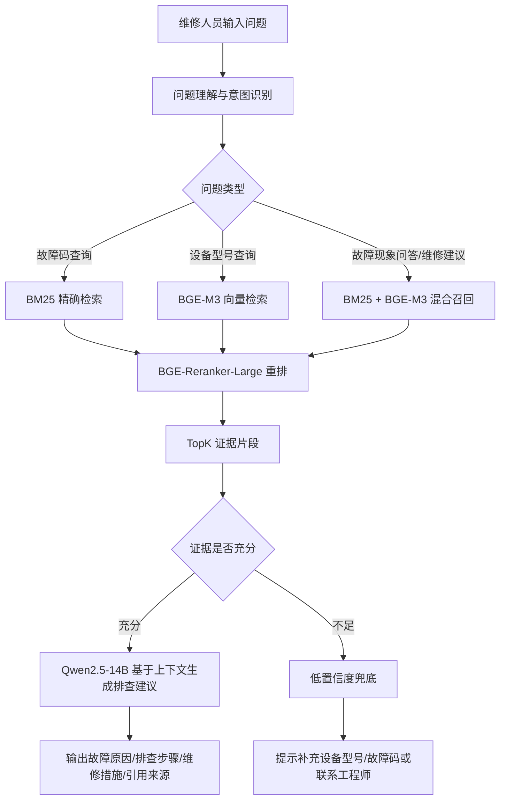
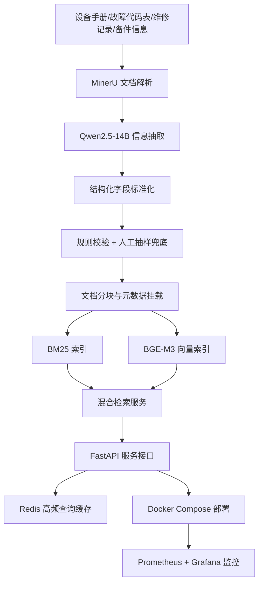
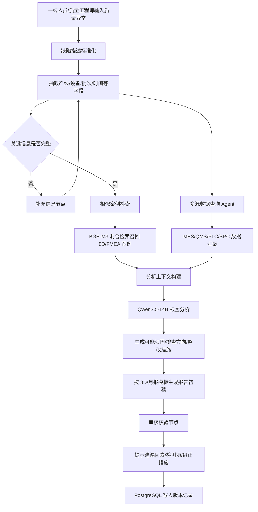
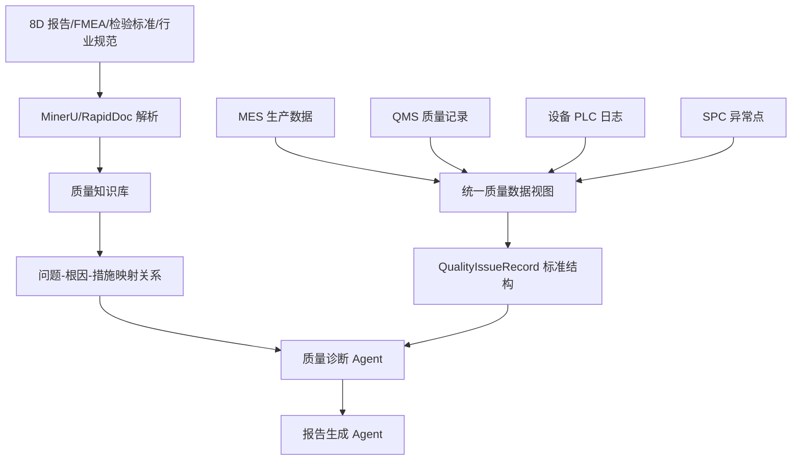
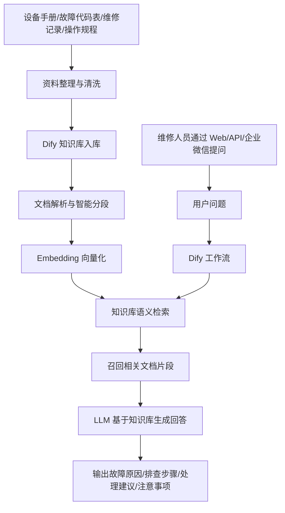
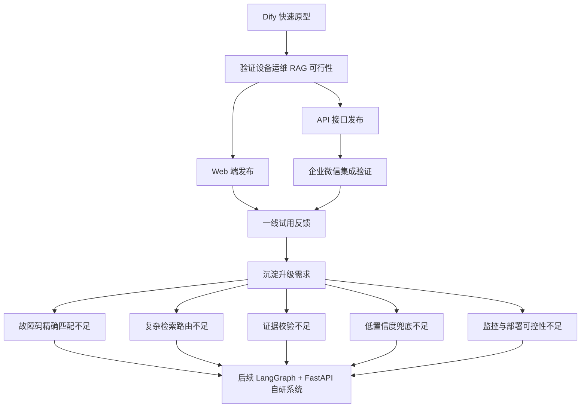

# 话术库 L1（合并版）— 刘城求职口述话术

> - 本文件 = CV-Agent 知识库 L1 层（口述展开答案），内容来自以下原始文档的**逐字合并**（未改写）：
>   1. `话术_自我介绍与项目详解.md`（自我介绍 + 设备运维 RAG / 质量分析报告助手逐节点口述 + MES/QMS/PLC 关系 + 优化与兜底问答）
>   2. `话术_RAG+Agent模块面试题.md` 的 RAG 模块（1.1~1.31，60+ 题含 ★ 难度）
>   3. 同上文档的 Agent 模块（2.1~2.27）
>   4. `项目流程图梳理与面试讲法.md`（3 项目 Mermaid 流程图 + 面试讲法 + 简历可压缩表达）
> - 与 `01_简历_L0_事实源.md` 冲突处以 L0 为准（指标口径差异见 `04_校对清单.md`）
> - 重复内容不在此处去重：M1 入库阶段按 chunk 内容 hash 去重，保证同语料双检索召回率
> - **重建方法**：`python scripts/merge_l1_docs.py`（任何原始文档改动后重跑即可）

# 第一部分 自我介绍与项目逐节点口述（源自：话术_自我介绍与项目详解.md）

面试官您好！我是刘城，毕业于重庆航天职业技术学院汽车电子专业。从2024年底入职东尼开始，我一直专注于大模型应用开发技术方向，目前有近2年的项目经验，做过从0到1的系统搭建，也做过复杂业务场景的落地交付

在技术层面，我熟练掌握RAG全链路、Agent智能体开发、LangChain和LangGraph框架，以及Qwen2.5等主流模型的微调和工程化部署。我能够独立完成从需求分析、方案设计到技术交付的完整闭环，这是我在上一家公司负责的核心工作

我最近也在关注贵公司在（汽车）方向的布局，我觉得自身的RAG和Agent落地经验与岗位要求匹配，希望能有机会加入团队，贡献力量。我的介绍完毕，谢谢！

### 设备运维arg系统？

2025年8月-2026年6月   2月完成部署

这个项目是面向设备运维场景的。我们厂里设备手册、故障代码、维修记录都分散在PDF、Word、Excel里，设备宕机时间很多，新员工都是老师傅，遇到大故障工程师解决不了才查手册但是要翻一堆资料所以我们想用RAG做一个智能问答系统，帮他们快速定位故障

我们公司主要是做ccs连接器的 给宁德时代  比亚迪  还有储能厂供货  华为特斯拉是今年新进来的

我们这个设备运维arg系统整个流程从用户输入开始。技术人员可能会输入故障码、设备型号，或者直接描述故障现象。**第一步是问题理解节点**，意图识别模块会判断用户到底想干什么——是查故障码含义？还是搜某个设备型号的常见故障？还是问某个现象怎么解决？

识别完意图之后，进入查询路由。如果是精确的故障码，我走BM25关键词检索；如果是模糊的现象描述，我走BGE-M3向量语义检索；如果两者都有，就走混合检索。***”因为不同的设备错误编码是不一样的

**BM25保证关键词精确命中，BGE-M3稠密向量捕捉语义相似，再加上BGE-M3稀疏向量做词权重匹配。** 三路召回的结果合并到一起

多路召回可能返回几十条结果，数据质量和相关性参差不齐。然后我们做精排节点二次筛选，把所有候选片段按相关性重新打分排序，把最可能相关的排在最前面。** ”

精排完只取Top-K，不会直接把结果喂给大模型，而是先做**证据校验**。检查这些召回片段里，是否包含用户输入的故障码、设备型号、维修措施这些关键字段。如果包含，说明知识库里有真凭实内容，进入生成环节；如果不包含，说明召回的可能是不相关的内容，这时候**绝对不能硬答**。”

精排完之后，我会取出Top-5的文本块做正则匹配和关键词命中做硬性指标校验，**硬匹配之后，我再做一次软校验。我会把用户的原始问题和召回文本块一起送进一个轻量级的**交叉编码器（Cross-Encoder）**，不生成内容，只是单纯打个相关性分数（0到1

- **置信度高（>85%）**：走正常流程，喂给Qwen2.5生成回答，同时带上引用来源。
- **置信度中（60%-85%）**：大模型可以生成答案，但必须在答案末尾加一句‘检索资料有限，以上仅供参考，建议核实’。维修完成加入此内容
- **置信度低（<60%）**：**直接落进兜底逻辑（Fallback）**。系统返回的答案是：‘。知识库里暂时没找到完全匹配依据，建议联系驻厂工程师人工排查，或检查输入是否正确。

“很多RAG系统的问题就是在这里——召回了垃圾，大模型还硬编一个答案。

证据充分的话，调用Qwen2.5-14B，基于上下文生成排查建议，同时把引用来源也一并输出，让用户知道答案是从哪份文档哪一页来的，**可溯源**

“证据不足就走兜底。系统不会编答案，而是明确告诉用户‘未检索到明确依据，请联系工程师’，同时把用户的问题记录下来，后续人工补充知识库。**工业场景的容错比炫技重要得多。** 

“最后一步是工程兜底。所有问答记录都会写日志，高频查询会进Redis缓存。下一次有人问类似问题，直接从缓存返回，不用再跑一遍检索和推理，可以节省推理时间6s左右

### 你做过哪些优化？效果怎么样？

从单路向量检索升级为BM25+稠密/稀疏双向量混合检索，再加ReRank精排，Recall@5从72%提升到89%。

模型做了INT8量化，推理速度提升40%，显存占用降低25%

加了Redis缓存高频查询、用了异步处理、Docker容器化部署，服务响应从平均15秒降到10秒以内，可用性达到95.5%以上。

### 你们项目如果还有可优化的点，你觉得是什么？

现在我们处理的是文本和表格，但工业场景还有很多电路图、设备照片，如果能把多模态大模型加进来，维修人员拍张照片就能问问题，体验会好很多。

### 项目上线出过问题吗？怎么处理的？

上线初期有一次服务响应突然变得很慢，工程师半夜打电话。后面我排查后发现是因为某个高频查询的缓存没命中，导致大量请求直接穿透到向量库，把检索服务打满了。”

### 内部系统API是什么？怎么对接的？限流熔断怎么做的

- MES系统提供**生产执行数据**：批次号、工艺参数（温度/压力/速度）、操作人员、设备编号；

- QMS系统提供**质量检验数据**：抽检结果、SPC异常点、缺陷记录；

- 还有PLC系统通过OPC UA协议采集设备实时运行数据。

- ### 它们之间是什么关系？

- **研发设计 (PLM)**：研发部门在PLM系统中完成新产品设计，输出产品物料清单（BOM）和工艺路线。

- **制定计划 (ERP)**：销售接到订单后，ERP系统根据PLM的BOM和库存情况，制定整体的生产计划、采购计划和财务预算。

- **仓储准备 (WMS)**：WMS系统根据ERP的采购到货通知和领料计划，管理物料的收货、上架、拣货和出库。

- **车间执行 (MES)**：MES系统接收ERP的生产订单，并依据PLM的工艺路线，将任务派发给具体设备和人，实时采集生产数据。

- **日常协作 (OA)**：在整个过程中，OA系统为所有员工提供审批流程（如生产工单的异常审批）、信息发布和日常沟通协作的平台。

## 质量分析报告助手

这个项目的起点是一线人员输入的缺陷描述 缺陷标准化同样一个质量问题，有人报‘划痕’，有人报‘表面有印子’，有人报‘外观不良’，如果直接用这些原始文本去查，统计出来的缺陷分布全是乱的。

标准化之后，系统检查关键字段是否完整：产线是哪条？设备编号是什么？批次号？发生时间？如果缺了关键字段，系统会主动反问用户补全，**而不是在信息不全的情况下瞎分析**

信息补全之后，系统并行做两件事

- **左边这一路**：去历史知识库里检索相似案例（8D报告、FMEA），看历史上这个问题怎么解决的；
- **右边这一路**：实时调用MES、QMS系统，查当前批次的工艺参数、质量记录、SPC有没有异常点。
- 历史和实时数据汇到一起之后，大模型综合两路信息，输出可能的根因、建议排查方向、整改措施

根因分析出来之后，系统不是只给一段文字，而是**按工厂现有的8D报告模板、质量月报模板自动填充章节**。标题、背景、问题描述、根因分析、整改措施这些章节自动生成，工程师只需要审核修改，不用从零开始写

报告生成之后，Agent会**自动对比历史同类报告**，提示‘这个分析里是不是漏了某种异常因素？历史上类似案例还排查过某某方向，这次有没有考虑？’相当于给质量工程师配了一个**AI审核员**，辅助查漏补缺。

## 怎么优化召回率？

**文档分块策略优化**一开始我用固定长度分块（512字符），结果发现很多故障排查步骤被切断了，比如‘排查步骤1’和‘步骤2’分到了两个块里，用户问‘怎么排查’的时候只能召回一半。我改成**语义分块**——按段落和标题层级来切，同时把重叠窗口从0调到64个字符，保证上下文连贯。单这一项，召回率就涨了5个点

**第二，混合检索架构。** 这是最核心的优化。原来只靠向量检索，BM25保底。我改成BM25+稠密向量+稀疏向量的**三路并行召回**——BM25保证故障码精确命中，BGE-M3稠密向量做语义泛化，BGE-M3稀疏向量做词权重匹配。三路结果合并去重后统一进精排。这一项把Recall@5从77%提到了85%，涨了8个点

我把Top-K从5调到8（多召回一些候选），相似度阈值从0.7降到0.6

召回的候选集更大了、更全了，给后续重排留足了素材

## 文档入库

- **PDF**（电子版）：用MinerU直接提取文字和表格结构，保留段落和标题层级；
- **扫描件PDF**：先走OCR（MinerU内置）识别文字，再做后处理校正（比如把识别错的‘0’和‘O’纠正回来）；
- **Word文档**：用python-docx库提取正文，保留标题样式用于后续语义分块；
- **Excel表格**：主要是故障代码表，用pandas读取后转成‘故障码-解释-排查步骤’的键值对格式，每条故障码作为一个独立文档片段入库；
- **TXT**：直接读取

# 第二部分 RAG 模块面试题（源自：话术_RAG+Agent模块面试题.md 第 1.x 节）

# RAG 模块面试题‑结合工业设备智能运维 RAG 系统项目口述话术

> 全部基于简历【工业设备智能运维 RAG 系统】项目，面试口述直接使用，制造业设备运维业务场景，Markdown 格式，可直接复制

## 1.1 RAG 的整体流程 / 链路 ★★★

**口述话术**

在我做的工业设备智能运维 RAG 系统中，完整链路分为：文档加载、文档解析抽取、文本切分、向量化入库、查询处理、多路召回、融合重排、证据校验、LLM 增强生成、兜底输出。

1. 文档加载：接入 PDF、扫描件、Word、Excel 等工业资料；
2. 文档解析：基于 MinerU 做版面解析，配合 Qwen2.5‑14B 做结构化字段抽取，提取设备台账、故障码、维修措施；
3. 文本切分：做语义分块，设置合理 overlap，避免故障相关上下文被切断；
4. 向量化存储：使用 BGE‑M3 生成稠密 + 稀疏向量存入向量库；
5. 用户查询：接收维修人员故障提问，做意图识别、query 改写；
6. 多路召回：BM25 关键词检索 + BGE‑M3 向量检索两路召回；
7. 结果融合：RRF reciprocal rank fusion 融合两路结果，去重；
8. 重排：BGE‑Reranker‑Large 做精排，筛选高相关片段；
9. 证据校验节点：校验召回片段是否包含故障码、设备型号等关键字段；
10. 生成与兜底：证据充足送入 Qwen2.5‑14B 生成带来源引用的故障排查建议；证据不足触发兜底回复，告知未检索到明确依据，建议联系工程师。

## 1.2 什么是 RAG？解决大模型的什么问题 ★

**口述话术**

RAG 即检索增强生成，核心是先从私有知识库检索事实资料，再交给大模型基于检索到的上下文来生成答案。

放到我们工业运维场景，要解决几个痛点：

第一，基座大模型没有工厂内部的设备手册、故障代码、历史维修记录这些私有知识；

第二，直接用大模型容易产生幻觉，乱编故障码、维修步骤，工业场景幻觉会误导维修，风险很高；

第三，设备资料会迭代更新，如果用微调，每次更新文档就要重新训练，成本很高。

RAG 的优势就是知识更新快、答案可以溯源引用来源、不需要重新训练模型，非常适合企业私有文档问答。

## 1.3 RAG 和微调怎么选 ★★★

**口述话术**

在我这个运维项目里面，我对两者的选型边界体会很深：

1. 如果是**私有知识、文档频繁变更、要求答案可溯源**，优先 RAG。比如设备手册、故障码、维修案例这些事实性内容，全部靠 RAG 来承载；
2. 如果是**输出格式、领域话术风格、指令跟随能力**，适合用微调。比如我希望模型固定输出 “故障现象‑可能原因‑排查步骤‑处理方案‑参考来源” 这种固定格式，会考虑 LoRA 微调做风格对齐；
3. 两者可以组合使用。我们项目主体能力靠 RAG 解决知识问题，同时使用 QLoRA 微调 Qwen2.5‑14B，优化工业术语理解以及输出格式；
4. 注意，微调解决不了事实幻觉，不能指望微调记住大量设备故障知识，知识源头必须来自 RAG 检索。

## 1.4 文档切分 / 分块有哪些策略 ★★★

**口述话术**

工业文档类型复杂，手册、故障表、维修记录格式各不相同，我对比过几种分块策略：

1. 定长递归切分：RecursiveCharacterTextSplitter，实现简单，但会把表格、故障条目切碎；
2. 结构切分：依据标题、表格边界切分，适合格式规整的设备手册；
3. 语义切分：基于 embedding 相似度识别语义边界，适合自由文本维修记录；
4. 父子块策略：子块用于检索，父块保留完整章节上下文用于给 LLM 生成。

我们项目没有直接一刀切，采用混合策略：手册类文档优先按标题结构切；故障码表格类做特殊处理保证一条故障码尽量在同一个 chunk；维修记录类采用递归切分，设置合理 overlap。块不能太小，太小丢失上下文；块太大，会带入大量无关噪声，拉低检索精度。

## 1.5 分块用什么工具 / 函数（LangChain 等） ★★★

**口述话术**

前期原型阶段我使用 LangChain 的`RecursiveCharacterTextSplitter`，也就是递归字符切分。

但工业场景很多扫描件、表格文档，原生 splitter 效果有限。所以后期自研处理链路：先用 MinerU 完成文档解析，输出结构化 markdown，再针对不同文档类型选择切分器。

对于故障码表格，我会写自定义切分逻辑，保证单条故障记录不被切割。参数不会写死，我会用离线测试集，调 chunk_size 和 overlap，看 Recall@5 指标变化，选效果最优的一组参数。

## 1.6 父子块（Parent‑Child）分块 ★★★

**口述话术**

父子块核心逻辑：小的子块用来向量化做检索，命中之后，回溯拿到完整大父块给到 LLM 做生成。

子块粒度小，检索更容易精准命中故障关键词；父块粒度大，保留完整的故障排查上下文。

在我们运维场景，比如一个大章节讲某设备全部故障，拆成很多小子块；用户检索命中其中一个子块，把父块完整章节喂给模型，避免只拿到碎片信息，导致回答残缺。

受限于项目工期，我们没有全量落地父子块，但做过技术验证，是后续迭代的备选优化方案。

## 1.7 分块的重叠（overlap）设多少 ★★

**口述话术**

行业通用经验一般设置块大小的 10%‑15% 作为 overlap。

举个例子，chunk_size 设置 512token，overlap 设置 50‑80token。

overlap 作用是防止一条故障描述刚好被切分在两块边界，导致关键信息丢失。

overlap 不能太大，太大引入重复噪声，增加 token 开销；太小边界信息丢失。我们项目不是直接套用默认值，是拿真实工业文档做评测，看边界 case 召回情况确定最终参数。

## 1.8 PDF / 复杂表格 / 扫描件怎么解析 ★★★

**口述话术**

这是工业 RAG 最大的坑，我们项目大量 PDF、扫描件、故障表格。

1. 普通文本 PDF：用 MinerU 提取文本与表格，直接输出 Markdown；

2. 扫描件 PDF：内部自带 OCR + 版面分析，识别图片里面的文字；

3. 双栏、跨页故障表格：MinerU 做版面还原，把跨页表格合并为完整 markdown 表格；

4. 解析完成之后还要做清洗：去除页眉页脚、乱码、无效水印；

5. 再交给 Qwen2.5‑14B 做信息抽取，提取故障码、设备型号、维修措施核心字段；

6. 规则校验加上人工抽样兜底，保证抽取准确率，我们最终做到核心字段提取 85% 以上。

   

   如果直接简单读取 PDF 文本，双栏文档会乱序，表格拆成一堆乱文本，检索效果会直接崩盘。

## 1.9 文档入库前怎么做数据清洗 / 治理 ★★★

**口述话术**

RAG 效果 80% 取决于数据质量，我们项目入库前做一整套数据治理：

1. 去重：MD5 比对，过滤完全重复文档；段落级用 SimHash 做近似去重；
2. 格式归一化：PDF、Word、Excel 全部统一转为 Markdown；
3. 文本归一化：全角半角统一，去除页眉页脚、水印、多余换行空格；
4. 脏数据拦截：过滤残缺、乱码、版本过期的手册；给文档打上元数据：文档来源、设备型号、版本号；
5. 半结构化处理：故障表格转 Markdown，方便后续切分和检索；
6. 抽样校验，不合格文档打回，不进入知识库。

## 1.10 Embedding / 向量化怎么做、模型怎么选 ★★★

**口述话术**

选型的时候对比过 text2vec，最终选用**BGE‑M3**。

理由有三点：第一中文表现好；第二同时输出稠密向量 + 稀疏向量，天然适配混合检索；第三支持长文本。

查询侧和文档侧使用同一个 Embedding 模型。

工业里面有大量专业设备术语，本来考虑过微调 Embedding 模型，但受限于标注样本数量，优先靠混合检索 + 重排来弥补，后续积累更多故障样本再考虑微调 Embedding。

## 1.11 向量数据库怎么选 ★★★

**口述话术**

选型对比过 FAISS、Milvus、Elasticsearch。

- FAISS：单机效果好，但是缺少服务化、元数据过滤能力，不适合线上生产；
- Milvus：向量能力强，支持 HNSW 索引，支持元数据过滤，适合我们知识库持续增量更新；
- Elasticsearch：自带 BM25，适合混合检索，但是向量性能弱于专业向量库。

我们项目最终采用 Milvus 作为向量库，同时 BM25 检索单独实现，做两路召回，RRF 融合。

## 1.12 什么是混合检索，为什么效果好 ★★★

**口述话术**

混合检索就是多路召回，我们项目采用 BM25 词法检索加上 BGE‑M3 稠密向量检索两路。

两者刚好互补：

BM25 擅长精确关键词匹配，比如故障码、设备型号这类专有名词；纯向量检索容易对专有名词出现漂移。

向量检索擅长语义匹配，维修人员口语化描述故障现象，同义词、转述提问，向量可以召回相关文档，BM25 就很难命中。

两路分别召回候选，用 RRF 做结果融合，之后再交给 Reranker 重排。

上线之后 Recall@5 从基线 72% 提升到 89%，故障代码精确匹配率达到 91% 以上。

## 1.13 混合检索多路结果怎么融合（RRF） ★★★

**口述话术**

BM25 的打分和向量余弦相似度分数量纲完全不一样，不能直接相加。

我们采用 RRF reciprocal rank fusion，核心只依赖每条文档在各路结果里面的排名，公式 `score = Σ 1/(k+rank)`。

不需要关心原始分数，只看排序位置，规避不同检索器分值无法对比的问题。

两路召回完成后，执行 RRF 融合，做文档去重，输出候选集合，再送入 Reranker 做精排。

## 1.14 为什么需要重排（Rerank），怎么实现 ★★★

**口述话术**

多路混合召回输出的是粗候选集，优先保证召回率，会带入不少相关性低的文档。

Rerank 交叉编码器，把 query 和文档片段成对输入模型，做相关性打分，做二次精筛。

我们项目使用 BGE‑Reranker‑Large。流程是：粗召回拿到 50 条候选，经过 Reranker 打分，筛选 top‑5 送入大模型生成。

Reranker 计算开销比较大，所以放在粗召回之后，只对少量候选做打分，平衡精度和性能。

经过重排之后，过滤掉大量看似向量相似但是实际无关的片段，进一步降低幻觉风险。

## 1.15 召回率低怎么提升 ★★★

**口述话术**

项目初期遇到过召回率低的问题，我有一套分层排查思路：

1. 先看数据层：文档解析是否乱码，切分策略是否把关键故障信息切碎；

2. 检索策略：是否只使用单路向量检索，补充 BM25 关键词召回，覆盖故障码等专有名词；

3. Query 处理：对用户输入故障 query 做改写、纠错、实体提取；

4. 调参：适当放大粗召回 topK，配合 Rerank 做过滤；

5. 模型层面：评估 Embedding 效果，如果领域偏差大，积累样本考虑微调 Embedding；

6. 最重要：构建离线测试集，每一轮改动用 Recall@5 指标量化验证。

   

   我当时自建 200 + 条工业场景测试集，完成整套调优，把 Recall@5 从 72% 提升至 89%。

## 1.16 你的检索链路怎么设计的 ★★★

**口述话术**

我们完整检索链路：

1. Query 预处理：意图识别，提取设备型号、故障码实体，做 query 改写；
2. 多路并行召回：BM25 关键词召回 + BGE‑M3 稠密向量召回；
3. RRF 结果融合，文档去重；
4. Reranker 重排打分；
5. 元数据过滤，过滤过期版本文档；
6. 输出 top‑N 候选片段；
7. 证据校验节点：校验候选片段是否包含故障码、设备型号关键字段；
8. 证据充足送入 LLM 生成；证据不足执行兜底回复。

## 1.17 什么时候触发检索，K 值怎么定 ★★★

**口述话术**

在我们运维系统中，只要识别到是故障咨询类意图，就会触发检索；闲聊类意图直接回复，不走检索，节约算力。

K 值分两层：粗召回我会取 50，保证尽可能把潜在相关文档捞出来；经过 Reranker 重排之后取 top‑5 给大模型做生成。

K 不能设置过大，会带入大量噪声，消耗 token；K 过小容易漏关键信息。K 不是拍脑袋设置，依托自建 200 多条测试集，对比不同 K 下面 Recall@5 指标确定参数。

## 1.18 检索内容缺失 / 结果互相矛盾怎么处理 ★★★

**口述话术**

工业场景经常出现两种情况：检索不到内容，或者多条文档故障处理方案互相冲突。

1. 检索缺失：不允许大模型强行编造答案，低置信度兜底策略，回复 “未检索到明确依据”，引导用户提供更完整设备型号 / 故障码，联系工程师处理；
2. 检索结果互相矛盾：输出的时候带上每一条参考来源，提示不同文档方案差异；
3. 提前预防：入库时维护文档版本元数据，过滤掉旧版过期手册；
4. bad case 回流，把这类 case 补充进测试集，持续迭代优化链路。

## 1.19 RAG 出现幻觉，怎么定位是检索还是生成问题 ★★★

**口述话术**

排查幻觉我会分开两层定位：

1. 先看检索层：把实际召回出来的文档片段打印出来，看里面是否包含回答里面的故障码、维修步骤。如果答案关键信息在召回文档里面根本不存在，属于**检索问题**，没有召回正确资料；
2. 如果召回文档已经包含正确信息，但是大模型输出的时候篡改、编造内容，那就是**生成侧幻觉**；
3. 我们项目会强制输出参考来源，方便人工校验；同时在证据校验节点校验关键实体是否存在于召回片段；
4. 也可以借助 RAGAS 工具，分别计算检索相关度和生成忠实度指标辅助定位。

## 1.20 幻觉怎么检测和缓解 ★★★

**口述话术**

工业运维，幻觉会误导维修，后果比较严重，我们做多手段缓解：

1. 检测层面：强制答案引用来源；证据校验节点校验故障码、设备型号是否存在检索片段；抽样人工评测；bad case 持续沉淀；
2. 检索侧：优先提升检索召回与重排效果，幻觉根源很多时候是检索不到正确资料；
3. 提示词约束：提示词严格约束只能依据提供参考资料作答，禁止编造；
4. 生成参数：适当降低 temperature，减少随机性；
5. 兜底策略：证据不足直接拒绝回答，不强行输出维修方案。

## 1.21 上下文长度 / 多轮对话怎么管理 ★★★

**口述话术**

维修人员会进行多轮故障排查对话，会遇到上下文越来越长的问题。

1. 做指代消解，多轮对话里面把代词还原成设备型号、故障码；
2. 不会无脑把全部历史对话塞给 prompt；做对话摘要压缩，保留故障核心信息；
3. 检索环节会基于当前最新问题，结合历史实体信息重新检索，而不是完全依赖上一轮检索结果；
4. 设置 token 上限，超长做截断，优先保留故障相关实体和检索片段。

## 1.22 RAG 系统怎么评估 ★★★

**口述话术**

我们项目分检索端、生成端两套评估体系。

1. 检索端指标：Recall@5、Precision@5、MRR，衡量能不能把正确故障文档召回并且排到靠前位置；
2. 生成端：答案相关性、忠实度、答案正确性；
3. 评估手段：自建 200 + 条覆盖常见、长尾、模糊查询的测试集；部分使用 RAGAS 做自动化评估，同时运维工程师人工抽样评测；
4. 每一次链路改动，跑一遍测试集回归，防止改 A 坏 B。

## 1.23 Query 改写怎么做、为什么需要 ★★

**口述话术**

一线维修人员提问口语化很严重，会简写故障码、表述模糊。

Query 改写目的就是把口语化、残缺的提问规范化，提升检索命中率。

我们项目主要靠大模型做 query 改写，同时做实体提取，提取设备型号、故障码。

举个例子：用户输入 “这个机器开机报警怎么办”，改写为对应设备型号 + 开机报警故障查询。

改写也会存在引入错误风险，所以我们会原始 query 和改写后的 query 两路同时检索，做双路召回，规避改写出错带来负面影响。

## 1.24 知识库怎么构建、索引怎么优化 ★★★

**口述话术**

知识库完整构建流程：

确定数据源→文档清洗治理→MinerU 解析→抽取结构化字段→切分→向量化→入库；

索引层面：Milvus 使用 HNSW 向量索引；BM25 构建倒排索引；入库附带元数据（设备型号、文档版本）支持过滤；

支持增量更新，新的设备手册可以增量入库；

定期跑测试集做检索回归，发现 bad case 反推知识库与切分策略优化。

项目最终完成 2 万 + 页工业文档完成结构化入库。

## 1.25 RAG 多租户 / 权限控制怎么做 ★★

**口述话术**

我们这套是工厂内部系统，没有做多租户，但是设计了元数据过滤的能力。

文档块入库的时候携带设备产线、文档密级元数据；查询的时候，根据当前登录用户所属产线，过滤向量检索和 BM25 检索结果，用户只能看到自己产线对应的设备资料。

如果做多租户场景，就是把 tenant_id 作为元数据，检索阶段直接过滤，配合 RBAC 权限体系。

## 1.26 RAG 的局限性 / 什么时候不适用 ★★

**口述话术**

从我们运维项目实践看，RAG 不是万能的：

1. 如果知识库里面完全没有对应故障资料，RAG 效果直接失效，只能走兜底；

2. 复杂多跳推理，单纯 RAG 能力有限，需要结合 Agent 多轮检索；

3. 纯 RAG 很难完成深度复杂计算；

4. 如果文档质量差、乱码严重，再强检索链路也救不回来。

   

   这类场景就需要结合 Agent、业务数据库查询来补充能力。

## 1.27 RAG 和 Agent 怎么结合 ★★

**口述话术**

在我们工业运维系统中，RAG 是 Agent 内部一个核心工具。

Agent 做任务规划，判断当前是否需要调用知识库检索；

- 用户问故障现象，Agent 调用 RAG 工具拿到故障手册片段；

- 如果一次检索信息不够，Agent 可以改写 query，多次检索；

- 同时还可以搭配另外的工具去查询数据库历史维修记录；

  

  Agent 整合 RAG 返回知识 + 数据库结构化数据，综合生成故障排查建议。

  

  不是简单单次 RAG 问答，而是 Agentic‑RAG 模式，由 Agent 控制检索时机、检索次数。

## 1.28 超长文本 RAG 怎么处理 ★

**口述话术**

设备手册单份文档非常长，几十上百页。

我们不会把整篇文档全部塞进 prompt。

1. 依靠分块策略，检索只召回相关片段；
2. 备选父子块方案，检索小子块，拿到局部对应的父块；
3. 多轮检索，分多次获取不同章节信息；
4. 后续迭代可以引入 GraphRAG，抽取设备故障实体关系，增强超长文档跨章节的关联能力。

## 1.29 RAG 数据从哪来、怎么治理 ★★★

**口述话术**

项目数据源来自企业内部：设备 PDF 手册、故障代码表、Word 维修记录、Excel 备件表。

治理流程：去重、格式统一、清洗页眉页脚水印；解析之后做字段抽取；打上来源、版本、设备型号元数据；脏数据拦截；人工抽样校验；

支持增量更新，新的维修记录持续入库；同时维护测试集，持续做效果回归。

## 1.30 关键词检索 vs 语义检索 vs 向量检索的区别 ★★★

**口述话术**

1. BM25 关键词检索：基于字面词匹配，故障码、专有名词命中效果好；缺点口语化、同义改写提问很难召回；
2. 向量检索也就是语义检索：把文本映射向量空间，擅长语义同义匹配；但是对专有名词、故障码容易出现语义漂移；
3. 两者不是二选一，工业场景一般采用混合检索，互补优势。我们项目就是 BM25+BGE‑M3 向量两路召回，再重排精筛。

## 1.31 RAG 回答效果不好，排查思路 ★★★

**口述话术**

线上 RAG 效果差，我会按照从底层到上层顺序逐层定位：

1. 数据层：文档解析是否乱码，切分策略是否合理，是否存在脏数据；
2. 检索层：看召回结果，Recall 指标，正确的文档有没有被召回；没有召回就调多路召回、query 改写；
3. 重排层：检查 Reranker 是否把正确的片段给排到后面；
4. 生成层：提示词约束、temperature 参数，是否没有忠实参考文档；
5. 评估：把 bad case 沉淀到测试集，修改策略之后做回归验证。

# 第三部分 Agent 模块面试题（源自：话术_RAG+Agent模块面试题.md 第 2.x 节）

# Agent 模块面试题 - 结合工业设备智能运维 RAG 系统项目口述话术

> 说明：全部基于简历中【工业设备智能运维 RAG 系统】项目，面试可直接口述，贴合制造业运维业务场景

## 2.1 什么是 Agent？说说你的理解

**口述话术**

Agent 本质是让大模型具备自主思考、任务拆解、调用外部工具完成复杂目标的能力，不再局限单纯问答。

在我们工业设备运维项目里，不只是简单检索知识库回答故障问题；当用户输入设备故障现象，Agent 可以自主判断：要不要查故障手册、要不要调用数据库查该设备历史维修记录、是否需要检索相似故障案例，把多步动作串联，最终给出完整维修方案，而不是只靠 RAG 做单次检索回答。核心就是**思考 + 工具调用 + 循环迭代 + 达成业务目标**。

## 2.2 一个 Agent 的整体架构怎么设计

**口述话术**

我在运维项目中基于 LangGraph 搭建 Agent，整体分为 5 个核心部分：

1. **感知输入层**：接收用户故障提问，做 query 改写、意图识别；
2. **思考规划层**：大模型做任务拆解，判断需要执行哪些步骤，比如 “提取故障码→检索运维知识库→查询设备历史记录→整合维修建议”；
3. **工具执行层**：对接 RAG 混合检索、PostgreSQL 设备维修库、外部查询接口等工具；
4. **状态管理层 State**：保存当前故障信息、中间检索结果、已经调用过的工具、历史对话；
5. **输出 / 终止判断层**：判断信息是否足够给出维修方案，如果信息不足继续调用工具，充足则整理输出维修建议，结束流程。

## 2.3 主 Agent 和子 Agent 怎么分工

**口述话术**

在我们运维系统做过主从 Agent 拆分：

- **主 Agent**：总调度，接收用户原始故障问题，负责整体任务拆解、全局状态维护，判断需要启用哪个子 Agent，控制整体流程终止，不会做具体细碎工作。

- 子 Agent

  ：专门负责单一细分任务。我这边拆分两个子 Agent：

  1. 知识库检索子 Agent：专门做故障文档检索、过滤无关文档，返回精准故障片段；

  2. 历史维修查询子 Agent：专门负责解析参数，查询数据库中该型号设备历史故障、停机记录。

     

     主 Agent 下发任务给子 Agent，子 Agent 完成后把结果回传给主 Agent，由主 Agent 整合全部信息生成最终维修方案。

## 2.4 多 Agent 之间怎么调度 / 协作

**口述话术**

项目里采用中心化调度模式，由主 Agent 充当调度中心：

1. 用户输入故障问题，主 Agent 解析目标，生成子任务清单；

2. 根据任务类型，分发任务给对应子 Agent；

3. 子 Agent 独立完成自身任务，把结果返回主 Agent；

4. 主 Agent 收集全部子 Agent 输出，校验信息完整性；

5. 如果信息缺失，重新调度对应子 Agent 补充查询；信息足够就整合输出答案。

   

   不会让子 Agent 之间直接互相调度，全部由主 Agent 管控，避免流程混乱，适合制造业这种追求可控、可追溯的业务。

## 2.5 多 Agent 之间怎么通信（A2A 等）

**口述话术**

我们项目没有用复杂 A2A 协议，基于 LangGraph 的 State 全局状态做通信。

所有 Agent 读写同一个共享 State 对象，故障现象、检索结果、数据库返回记录全部放在 State。

- 主 Agent 往 State 写入待处理任务；
- 子 Agent 读取 State 拿到任务参数，执行完成后，把结果写回 State；
- 主 Agent 再从 State 读取子 Agent 产出，完成汇总。

如果跨服务多 Agent 场景，也可以用消息队列完成 A2A 通信。但工业内部系统优先使用共享状态，简单可控，每一步数据都留存，方便排查线上故障。

## 2.6 节点是怎么设计的（LangGraph）

**口述话术**

我在运维 Agent 里拆分了这些 LangGraph 节点：

1. `query_parse节点`：解析用户故障提问，提取设备型号、故障码，做 query 改写；
2. `task_planner节点`：任务规划，决定要调用哪些工具；
3. `knowledge_retrieve节点`：执行 RAG 混合检索，BM25 + 向量检索 + 重排；
4. `db_query节点`：调用工具查询设备历史维修数据库；
5. `judge_sufficient节点`：条件判断节点，判断拿到信息够不够回答故障问题；
6. `gen_answer节点`：整合全部信息生成维修方案。

节点之间靠条件边流转，比如判断节点如果信息不足，就跳转回规划节点继续调用工具；信息足够，流转到生成答案节点结束。每个节点职责单一，方便单独调试、日志埋点。

## 2.7 Agent 的状态（State）怎么管理

**口述话术**

State 用 TypedDict 自定义，保存整个 Agent 全流程所有上下文。

我们项目 State 关键字段：

- 用户原始 query、提取出来的设备型号、故障码；
- 已经完成的子任务列表；
- RAG 检索返回的文档片段；
- 数据库查询出来的历史维修记录；
- 历史工具调用记录；
- 中间思考过程；
- 最终输出答案。

每一个节点只能修改 State 中自己负责的字段，不会覆盖全部状态。LangGraph 会自动保存每一步 State 快照，线上出问题可以回溯每一步状态，方便定位为什么给出错误维修建议。

## 2.8 Agent 中断后怎么断点恢复

**口述话术**

LangGraph 原生支持 checkpoint 持久化。我们把每一步的 State 快照持久化存入 Redis。

当 Agent 流程被中断，比如接口超时、用户中途退出。后续用户重新提问，传入同一个会话 ID，就可以读取 Redis 里保存的 checkpoint，直接从上一步中断节点继续执行，不需要从头重新跑一遍全部流程。

我们运维场景会遇到用户故障查询一半，临时去现场处理设备，回来继续提问，断点恢复就很实用。

## 2.9 Agent 的短期 / 长期记忆怎么实现

**口述话术**

1. **短期记忆**：保存在当前会话 State 中，本次对话内全部上下文，当前故障的思考、工具调用记录，只在这一轮会话生效。

2. 长期记忆

   ：持久化存储。我们项目把历史会话、用户经常查询的设备型号、高频故障，存入 PostgreSQL。当同一个用户再次咨询同一台设备故障，Agent 会读取长期记忆，知道之前排查过哪些故障，避免重复调用工具重复检索。

   

   同时会做记忆过滤，只留存业务有效信息，不会把全部大模型输出无脑存库。

## 2.10 上下文太长怎么压缩

**口述话术**

运维场景，多次调用工具后，State 里面会堆积大量检索文档、工具返回结果，很容易触发上下文窗口超限。项目中使用 3 种方案：

1. **滑动窗口截断**：保留最新 N 轮关键信息，丢弃老旧无效内容；

2. **摘要压缩**：调用大模型对长工具返回结果做摘要，保留故障关键信息，压缩文本长度；

3. 过滤冗余文档

   ：RAG 返回的文档，通过 rerank 过滤低相似度片段，不全部塞进 prompt。

   

   三种组合使用，避免上下文溢出，同时尽量不丢失维修关键信息。

## 2.11 工具调用（Function Call/Tool Calling）原理

**口述话术**

Function Call 本质大模型不直接输出自然语言，输出结构化 JSON，里面包含要调用的工具名称、入参。

在我们项目中，我会把工具描述、参数定义传给大模型。当模型判断需要查设备历史记录，就输出 JSON：工具名 db_query，参数设备型号、故障码。后端解析这个 JSON，执行真实函数拿到结果，再把工具返回结果塞回 prompt 交给大模型，循环迭代。

注意：部分开源基座原生 function call 能力弱，需要我们自己做 prompt 约束，强制输出 JSON 格式，做格式校验。

## 2.12 工具注册怎么实现

**口述话术**

项目中，我们把 RAG 检索、数据库查询等工具统一封装。

使用 LangChain 的 Tool 装饰器完成注册：写好工具函数，定义工具名字、功能描述、入参 JSON Schema。注册之后传给 Agent。

Agent 拿到注册列表，会把全部工具描述塞进 prompt，让大模型知道每个工具能力、需要什么参数。新增工具只需要写函数 + 注册，不需要改动 Agent 主流程，实现工具插件化。

## 2.13 MCP 是什么

**口述话术**

MCP 全称 Model Context Protocol，模型上下文协议。标准化的工具调用协议，把工具能力标准化描述，Agent 可以按照协议自动发现、调用外部工具，不用针对每个工具单独写 prompt、解析逻辑。简单理解就是工具调用的标准化规范。

## 2.14 MCP、Function Call、Skill 有什么区别

**口述话术**

1. **Function Call**：是大模型能力，模型输出结构化参数，完成工具调用，偏向底层模型能力；

2. **Skill**：业务层面概念，一个 Skill 是一组能力，比如 “设备故障查询 Skill”，内部可以包含多个 Function；偏向业务封装；

3. MCP

   ：一套协议规范，统一工具描述、入参出参格式，实现工具和 Agent 解耦。

   

   拿我的运维项目举例：查询设备历史记录，底层用 Function Call；整个 “设备历史查询” 封装成一个 Skill；如果对接外部第三方系统，就可以通过 MCP 协议接入。

## 2.15 Skill 怎么封装和使用

**口述话术**

在运维项目，Skill 做业务能力封装。

封装步骤：

1. 梳理业务能力，定义 Skill 能力、输入输出；
2. 内部封装底层 Function、鉴权、异常捕获；
3. 写清晰描述、参数 Schema；
4. 注册给 Agent。

使用的时候 Agent 不需要关心底层实现，只知道 Skill 能力。比如「查询设备历史故障 Skill」，Agent 只需要传入设备型号，Skill 内部完成参数校验、数据库查询、异常捕获，返回整理后的故障记录。后续如果数据库切换，只改 Skill 内部代码，上层 Agent 不用改动。

## 2.16 意图识别怎么做

**口述话术**

我们运维项目意图主要两类：故障咨询意图、普通闲聊意图。

两种方案结合：

1. 轻量：提示词 + 大模型做意图识别，把候选意图写进 prompt，让模型输出结构化意图、提取实体（设备型号、故障码）；适合快速落地，也是项目主要方案；

2. 兜底：少量标注样本训练小的文本分类模型，做兜底，过滤无效闲聊。

   

   识别出是故障咨询，才会走到 Agent 任务拆解流程；闲聊直接回复，不触发工具调用，节约资源。

## 2.17 任务规划 / 拆解怎么做（ReAct）

**口述话术**

项目 Agent 核心用 ReAct 的思考 - 行动循环。

当用户给到故障现象，模型先思考 Thought：要解决这个故障，我需要拿到哪些信息？比如：①提取故障码；②检索运维手册；③查询该设备历史维修记录。

然后 Action：选择对应工具执行；拿到 Observation 工具返回结果。

循环：拿到结果之后再次思考信息够不够，如果不够继续调用工具；信息充足就停止循环输出维修方案。

在 LangGraph 中，通过循环节点实现 ReAct，设置最大迭代轮次，防止无限循环。

## 2.18 多 Agent 死循环怎么防

**口述话术**

在工业 Agent 项目，死循环是线上很大风险，我做四层防护：

1. **最大迭代轮次限制**：全局设置最大工具调用次数，比如最多 5 轮，达到直接强制终止流程；
2. **状态记录已执行任务**：State 记录已经调用过的工具以及参数，避免完全相同参数重复调用同一个工具；
3. **条件判断校验**：在 judge_sufficient 节点校验返回信息，判断信息是否有增益，如果多次调用工具拿到几乎一样结果，直接终止；
4. **人工兜底 HITL**：触发轮次阈值之后，自动进入人工审核节点，交给运维人员介入。

## 2.19 工具调用出错 / 参数错误怎么办

**口述话术**

线上经常出现模型输出参数错误，比如设备型号填错，数据库查询返回空。项目处理方案：

1. **参数 Schema 校验**：拿到模型输出 JSON，做参数校验，类型、必填项不对直接捕获异常；
2. **异常捕获重试机制**：捕获工具调用报错，允许有限次数重试，同时把错误信息回传给大模型，提示模型修正参数；
3. **重试次数上限**，不能无限重试；超过次数，不继续调用工具，直接告诉用户工具查询失败，基于已有的 RAG 知识库给出参考建议；
4. **完整日志记录**，记录错误参数、报错堆栈，方便后续调优提示词。

## 2.20 人机协同（HITL）怎么设计

**口述话术**

我们运维业务对准确性要求高，不能完全信任 Agent 输出，做了 HITL 人机协同。

触发人工介入的场景：

1. Agent 迭代达到最大轮次，依旧没有拿到足够故障信息；
2. 故障属于高危设备故障；
3. Agent 对输出结果置信度低。

流程：触发之后 Agent 暂停 LangGraph 流程，把已经收集全部故障信息、检索中间结果推送给运维工程师；工程师可以补充信息、修改参数，确认之后，再恢复 Agent 流程继续执行；工程师也可以直接输出维修结论结束会话。

同时保存人工操作记录，用来后续优化 prompt 和测试集。

## 2.21 LangChain 和 LangGraph 怎么选

**口述话术**

结合我的项目经验：

1. **LangChain**：适合简单线性链路，一步接一步执行，没有复杂循环、分支。简单 RAG 问答，直接 LangChain 就足够，开发快。

2. LangGraph

   ：适合 Agent 场景，存在循环、条件分支、断点恢复、状态管理。我们工业运维 Agent，需要 ReAct 循环、多节点流转、checkpoint 断点恢复，所以选择 LangGraph。

   

   简单说：线性流程 LangChain；有循环、分支、多轮工具调用 Agent 优先 LangGraph。我项目前期用 LangChain 做简单原型，业务复杂之后迁移 LangGraph。

## 2.22 Dify 和 Coze 有什么区别

**口述话术**

两者都是低代码 AI 平台：

- **Dify**：开源，可以私有化部署，方便二次开发，RAG 能力很强，适合企业内部私有化知识库项目。我们项目最开始用 Dify 快速做原型，但是复杂 Agent 循环、自定义节点受限，后面自研 LangGraph。

- Coze

  ：扣子，字节的平台，生态强，插件丰富，快速对接各类 IM 渠道；私有化部署成本高，二次开发自由度不如 Dify。

  

  简单选型：要私有化、二次开发优先 Dify；快速做 bot、对接多渠道优先 Coze。

## 2.23 LangChain 和 LlamaIndex 怎么选

**口述话术**

- **LlamaIndex**：强项是索引构建、文档解析、RAG 检索，针对知识库做了很多优化；但是 Agent、工具调用生态弱一点。

- LangChain

  ：生态非常完善，Agent、工具、LangGraph、各种第三方组件丰富。

  

  我们项目：文档解析阶段用 MinerU，RAG 检索自己封装 BM25 + 向量，Agent 流程基于 LangChain+LangGraph。

  

  选型建议：如果核心只做知识库检索 RAG，可以选 LlamaIndex；要做复杂 Agent、大量工具调用，优先 LangChain。

## 2.24 低代码工作流 和 Agent 的区别

**口述话术**

1. **低代码工作流（Dify 拖拽工作流）**：流程是固定写死，条件分支都是人提前配置好，路径固定。比如：固定第一步检索知识库，第二步调用接口。模型不能自主新增步骤。
2. **Agent**：模型自主思考，动态决定下一步做什么，流程不是硬编码。遇到不同故障，会动态选择调用不同工具。

我们项目前期 Dify 低代码原型，流程固定，遇到复杂故障场景，固定流程不够灵活，所以自研 LangGraph Agent，由模型动态规划任务。

简单场景固定流程选低代码；需要模型自主思考动态拆解任务，用 Agent。

## 2.25 Agent 项目怎么评估

**口述话术**

拿我的工业运维 Agent 项目，分几个维度评估：

1. **业务指标（最重要）**：故障根因定位耗时，产线故障停机时间下降幅度，就像我们项目停机时间从 3000min 降到 600min；运维人员使用频次；

2. **能力指标**：召回 Recall@5、工具调用准确率，参数是否正确，是否触发死循环；测试集验证复杂故障场景能不能正确拆解任务；

3. **工程指标**：响应耗时、可用性、报错率，工具调用失败率；

4. 人工评估

   ：运维工程师人工评估 Agent 给出维修方案是否可用。

   

   我们自建 200 多条故障测试集，用来迭代评估 Agent 效果。

## 2.26 Agent 用大模型怎么选型

**口述话术**

做工业运维 Agent，优先看几个点：

1. **Function Call 能力**，工具调用 JSON 输出稳定性是第一位；
2. **长上下文能力**，Agent 多轮工具调用，会带入大量检索文档；
3. **垂直领域适配**，对工业术语理解；
4. **私有化部署**，工厂内部数据不能外传，必须本地部署。

项目选用 Qwen2.5‑14B，开源可私有化，Function Call 表现不错；同时做 QLoRA 微调，灌入运维故障样本，提升工业术语理解、工具调用准确率。如果是公有云场景，也可以选闭源大模型，但是工业场景优先本地开源模型。

## 2.27 AI 编程工具 / Coding Agent 了解吗

**口述话术**

Coding Agent 是专门面向代码场景的 Agent，自主完成需求拆解、代码编写、调试报错。可以调用工具执行代码、查文档。

对比我们运维 Agent，逻辑框架相通，只是 Skill 工具不一样。Coding Agent 工具是代码执行器、文档检索；我们运维 Agent 工具是 RAG 知识库、业务数据库。

我平时开发也会使用这类工具辅助写 LangGraph 节点、调试 Agent 代码。

# 第四部分 项目流程图梳理与面试讲法（源自：项目流程图梳理与面试讲法.md）

# 刘城简历 - 3 个项目流程图梳理

> 用法建议：下面的 Mermaid 代码可以直接复制到支持 Mermaid 的 Markdown、飞书文档、语雀、Notion 插件、draw.io 或 ProcessOn 中渲染成流程图。面试讲解时建议按“业务问题 -> 数据来源 -> 核心流程 -> 技术亮点 -> 结果指标”的顺序讲。

## 1. 工业设备智能运维 RAG 系统

### 核心业务流程图

### 知识入库与工程化流程图

### 面试讲法

这个项目是为设备运维场景做的自研 RAG 问答和故障排查系统，目标是把分散在 PDF、扫描件、Word、Excel 和业务系统里的设备知识统一结构化，让一线维修人员能按故障码、设备型号或故障现象快速获取排查建议。核心流程是用 LangGraph 编排“问题理解 -> 查询路由 -> 混合检索 -> 重排 -> 证据校验 -> 答案生成 -> 兜底处理”。我的重点工作是知识结构化标准设计、MinerU + Qwen2.5-14B 抽取链路、BM25 + BGE-M3 混合检索和 BGE-Reranker 精排优化，并通过 FastAPI、Redis、Docker Compose 和监控看板完成工程化落地。

### 简历中可压缩表达

主导工业设备运维 RAG 系统核心链路建设，基于 LangGraph 编排问题理解、查询路由、混合检索、重排、证据校验、答案生成与兜底流程；设计 BM25 + BGE-M3 混合召回和 BGE-Reranker 精排方案，将 Recall@5 提升至 89%，故障代码精确匹配率达 90%+。

## 2. 质量分析报告助手

### 核心业务流程图

### 数据与知识底座流程图

### 面试讲法

这个项目面向制造业质量分析，解决质量工程师需要跨 MES、QMS、PLC、SPC 和历史 8D/FMEA 文档人工汇总的问题。整体流程分为两层：第一层是质量数据和文档知识底座，把结构化业务数据和非结构化质量文档统一进质量分析上下文；第二层是 Agent 流程，用 LangGraph 编排缺陷标准化、数据补全、相似案例检索、多源数据查询、根因分析、报告生成、审核校验和版本记录。我的核心贡献是 QualityIssueRecord 数据结构设计、多源数据接入、缺陷智能分类、根因分析 Agent 和报告生成 Agent 的链路建设。

### 简历中可压缩表达

参与构建 RAG + Agent 质量分析报告助手，基于 LangGraph 编排缺陷标准化、数据补全、历史案例检索、多源数据查询、根因分析、报告生成和审核校验流程；沉淀 800+ 条“问题-根因-措施”映射关系，将历史案例 Recall@5 从 68% 提升至 87%，8D 报告周期从 5 天压缩至 2 天。

## 3. 设备运维助手（Dify 原型）

### 核心业务流程图

### 原型验证到自研升级流程图

### 面试讲法

这个项目是设备运维知识问答的前期 Dify 原型，主要价值不是复杂算法，而是快速验证业务可行性。我负责 Dify 平台选型、知识库配置、设备文档入库、检索参数和 Prompt 优化，并把应用发布为 Web/API，同时完成企业微信集成验证。这个原型证明了设备资料问答和历史故障经验复用可行，也暴露了 Dify 在精确匹配、复杂路由、证据校验、兜底、监控和部署可控性上的限制，因此自然引出了后续 LangGraph + FastAPI 自研升级项目。

### 简历中可压缩表达

基于 Dify 快速搭建设备运维 RAG 问答原型，完成多源文档入库、分段向量化、检索参数与 Prompt 优化，并发布 Web/API 与企业微信集成；在试用中沉淀故障码精确匹配、复杂检索路由、证据校验和工程化部署等升级需求，为后续自研系统提供依据。

## 总体梳理建议

三段项目可以按“原型验证 -> 自研升级 -> 横向复制到质量场景”的逻辑讲：

1. 设备运维助手（Dify）：快速验证 RAG 在设备运维场景的可行性。
2. 工业设备智能运维 RAG 系统：针对 Dify 原型限制，做 LangGraph + FastAPI 自研升级。
3. 质量分析报告助手：将 RAG + Agent 能力扩展到质量分析和报告生成场景。

这样讲会比单独罗列三个项目更有连续性，也能体现你不是只会搭工具，而是能从业务痛点、原型验证、工程升级到场景复用完成闭环。
